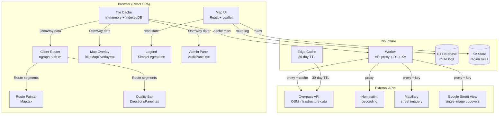
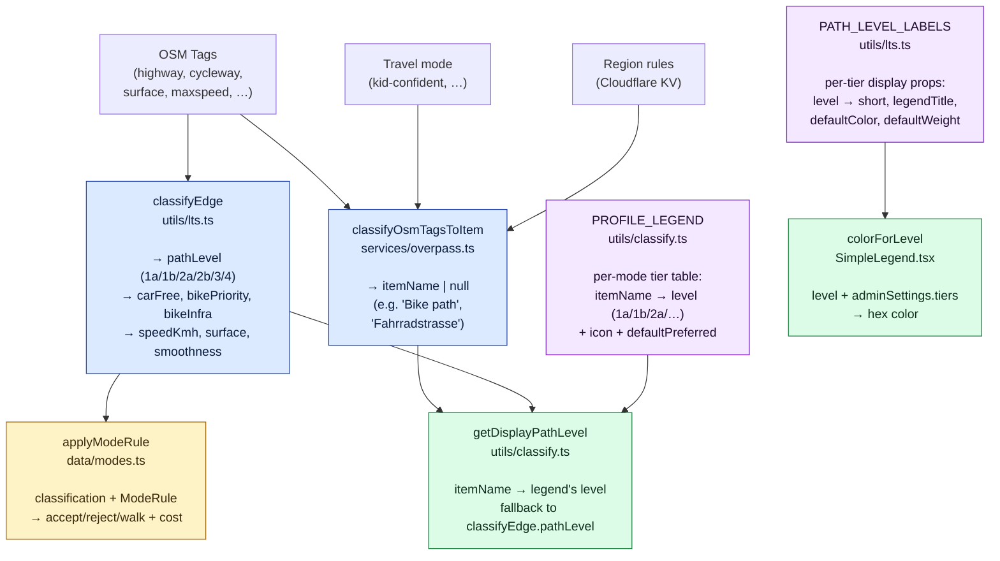
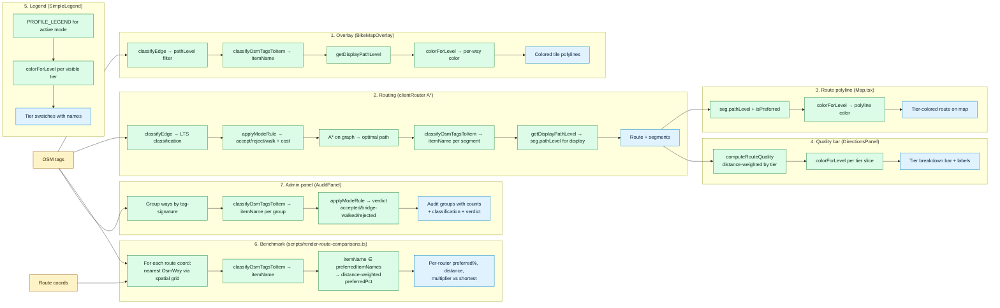
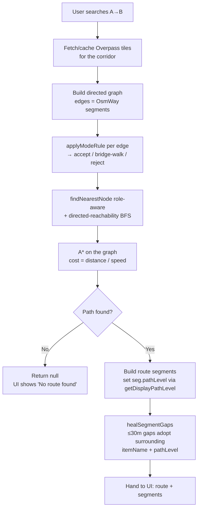
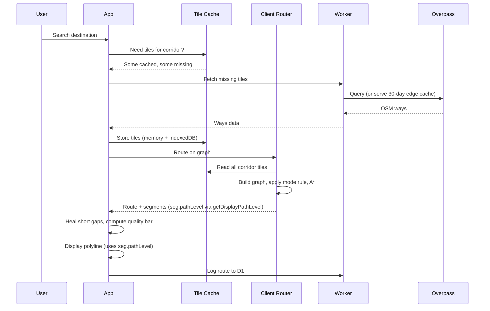

# Technical Architecture

## System Overview

## Classification — single source of truth

Three pure functions classify OSM tags. Different consumers want different outputs, but all consumers go through the **same primitives**.

**Architectural rule (post-2026-04-28):**
- `classifyEdge` (LTS-tier-derived from raw tags) is the **routing classifier**. `applyModeRule` reads it for accept/reject + edge-cost decisions.
- `classifyOsmTagsToItem` (legend-item-derived from raw tags) is the **identity classifier**. It answers "what kind of infrastructure is this?" e.g. 'Bike path' vs 'Fahrradstrasse'.
- `getDisplayPathLevel(itemName, mode, fallbackPathLevel)` is the **display classifier**. The legend's `PROFILE_LEGEND[item].level` is canonical when an itemName matches; classifyEdge is the fallback for unclassified ways. Every display surface (overlay, route polyline, quality bar) goes through this.
- `colorForLevel(level)` reads `PATH_LEVEL_LABELS[level].defaultColor` (or admin override). Single hex per tier.

This means: if a way maps to 'Bike path' (a 1a item per the legend), it renders dark green in the legend, the overlay, the route polyline, AND the bar — even if `classifyEdge`'s LTS rules would have called the same way pathLevel='3'.

## Per-consumer flow

**Key observations**:

- **Routing (2) and display (3, 4) share segments** — the route's `seg.pathLevel` is set by `getDisplayPathLevel` in clientRouter, so the polyline painter, the quality bar, and the legend all see the same canonical tier per segment.
- **Overlay (1) doesn't depend on routing** — it classifies every visible OSM way independently, but uses the **same** `getDisplayPathLevel` helper as the route, so identical ways color identically.
- **Benchmark (6) is intentionally independent of routing internals** — it does its own coord-to-way matching and reads `classifyOsmTagsToItem` directly. By design: a benchmark that piggybacked on `clientRouter`'s output would be self-validating.
- **Admin panel (7) reads the routing classifier directly** — `applyModeRule` produces the verdict (accepted / bridge-walked / rejected) that the user sees per audit group. This is the source of truth for "would the router accept this tag combination?"

## Routing internals

### Cost model

The router uses **time as cost** — `cost = distance / speed`, where speed depends on the mode rule's classification of the edge.

| Edge fate | Speed used | Result |
|---|---|---|
| Accepted by `applyModeRule` | mode's `ridingSpeedKmh` (or `slowSpeedKmh` for non-bike-priority residential) | Cheap edge — router prefers |
| `applyModeRule` rejects but `isBridgeWalkable` true | mode's `walkingSpeedKmh` (3 km/h) | Expensive edge — only used as bridge across short gaps |
| `applyModeRule` rejects + not walkable (motorway / `sidewalk=no`) | n/a — edge not added | Genuinely unusable |

This composes cleanly without arbitrary penalty multipliers — a 200 m walk-bridge is more expensive than a 1 km cycleway detour by construction.

### Reachability (post-2026-04-24 fix)

`findNearestNode` is **role-aware** (start needs ≥1 outgoing edge, end needs ≥1 incoming edge) and **reachability-restricted** (the end-snap is constrained to nodes in the directed-reachable set from the start, computed via BFS). Without these, ~25% of SF benchmark samples returned null even though a viable endpoint was 20-100 m away. See `docs/process/learnings.md`.

## Data flow (route request)

## Travel modes

Five public modes, defined in `src/data/modes.ts`. Each has a `ModeRule` that drives `applyModeRule` (accept/reject/cost) and a `PROFILE_LEGEND` entry that drives the legend + display tier:

| Mode | Legend-preferred tiers | Router behavior |
|---|---|---|
| **kid-starting-out** | 1a only | Strict — only fully car-free paths; everything else is bridge-walk |
| **kid-confident** | 1a + 1b | Adds bike-priority shared streets (Fahrradstraße, living streets) |
| **kid-traffic-savvy** | 1a + 1b + 2a | Adds painted lanes on quiet streets |
| **carrying-kid** | 1a + 1b + 2a + 2b | Adds quiet residential without bike infra |
| **training** *(admin-flagged off in prod)* | 1a + 1b + 2a + 2b + 3 | Adds higher-traffic streets |

Stamina is orthogonal — `ModeRule` doesn't cap distance. Families judge that themselves.

## Key files

| File | Purpose |
|------|---------|
| `src/utils/lts.ts` | `classifyEdge`, `PathLevel`, `PATH_LEVEL_LABELS` (single legend table) |
| `src/utils/classify.ts` | `PROFILE_LEGEND`, `getDisplayPathLevel`, `getLegendItem`, `computeRouteQuality`, `healSegmentGaps`, `PREFERRED_COLOR`/`OTHER_COLOR`/`WALKING_COLOR` |
| `src/data/modes.ts` | `MODE_RULES`, `applyModeRule` |
| `src/services/overpass.ts` | Overpass query + 30-day edge cache + `classifyOsmTagsToItem` |
| `src/services/clientRouter.ts` | Client-side A*, `findNearestNode` (role-aware + reachability-restricted), graph builder |
| `src/services/routeScorer.ts` | Re-classify a route's coords against tile data (post-build enrichment) |
| `src/services/audit.ts` | City scan, tag grouping, classification audit |
| `src/services/rules.ts` | Per-region classification rules (KV) |
| `src/components/Map.tsx` | Leaflet map, route polyline painter |
| `src/components/BikeMapOverlay.tsx` | Per-way bike infrastructure overlay |
| `src/components/SimpleLegend.tsx` | `colorForLevel`, tier swatches; `SIMPLE_TIERS` derived from `PATH_LEVEL_LABELS` |
| `src/components/DirectionsPanel.tsx` | Quality bar (uses `computeRouteQuality`), navigation, segment popups |
| `src/components/AdminPanel.tsx` | Audit + Settings + Routing Benchmarks tabs |
| `src/components/AdminBenchmarksTab.tsx` | Lists past benchmark runs from `public/route-compare/history.jsonl` |
| `src/services/adminSettings.ts` | Tier color/weight overrides + per-mode routing knobs (default tiers derive from `PATH_LEVEL_LABELS`) |
| `src/worker.ts` | Cloudflare Worker: Overpass / Mapillary / Street View / Nominatim proxies, D1 logging, KV rules, Sentry capture |
| `scripts/render-route-comparisons.ts` | Benchmark generator: client + Valhalla + BRouter + Google routes, distance-weighted preferred%, per-mode summary, charts |
| `scripts/fetch-google-routes.ts` | One-time fetch of Google Directions bicycling routes for the benchmark fixture set |

## Infrastructure

| Service | Purpose | Cost |
|---------|---------|------|
| Cloudflare Pages + Workers | SPA hosting + API proxy | Free tier |
| Cloudflare KV | Region classification rules | Free tier |
| Cloudflare D1 | Route logs, segment feedback | Free tier |
| Cloudflare Edge Cache | 30-day Overpass tile cache | Free |
| Sentry | Error tracking (frontend + Worker) | Free tier |
| Userback | User-initiated feedback widget | Free tier (paid plan for prod) |
| PostHog | Session analytics | Free tier |
| Mapillary | Bulk audit street imagery | Free API |
| Google Street View Static | Single-image segment popovers | $7 / 1000 (under free $200 monthly credit) |
| Overpass (public) | OSM infrastructure data | Free |
| Nominatim (public) | Geocoding | Free |

## Architecture rules

1. **Single classification source.** Display tier comes from `getDisplayPathLevel(itemName, mode, fallback)`. Routing tier (for cost decisions) comes from `classifyEdge`. The two are bridged via `getDisplayPathLevel`'s fallback when no legend-item match. New display surfaces MUST use this helper, not call `classifyEdge` directly.
2. **One legend table.** `PATH_LEVEL_LABELS` in `utils/lts.ts` carries `short`, `legendTitle`, `description`, `displayDescription`, `defaultColor`, `defaultWeight`. Other surfaces (admin tier defaults, SimpleLegend) derive from it; nothing redeclares hex codes inline.
3. **Never push to main.** Always branch → PR → CI → merge.
4. **Tile cache is the routing graph.** What you see on the overlay IS what the router routes on (modulo the `applyModeRule` accept/reject logic).
5. **Speed IS the penalty.** No arbitrary multipliers in cost. Walking is slow → high cost → router finds detours.
6. **Heal intersection gaps.** Short non-preferred segments between preferred segments adopt the surrounding `itemName` AND `pathLevel` (post-2026-04-28 fix — was just `itemName`, leaving pathLevel stale).
7. **Routing changes require a benchmark.** Per `.claude/rules/routing-changes.md`, edits to `clientRouter.ts`, `modes.ts`, `lts.ts`, `classify.ts`, or `overpass.ts`'s query must run `bun scripts/render-route-comparisons.ts` and commit a `docs/research/YYYY-MM-DD-routing-benchmark-results.md`. Display-only changes (no edge-cost / graph / routes-returned change) are exempt.
8. **One benchmark folder, frozen.** `public/route-compare/2026-04-24-0.1.184-local-5478dd5-dirty/` is pinned to the launch blog post — do not regenerate.
9. **City-agnostic.** Tile fetching, caching, routing, and the benchmark all work for any city, not just Berlin.

## See also

- `docs/process/learnings.md` — non-obvious gotchas worth keeping fresh in mind
- `docs/research/2026-04-24-findnearestnode-reachability-fix.md` — diagnosis and benchmark for the `findNearestNode` directed-reachability fix (client router went 77% → 100% success)
- `docs/research/2026-04-25-ux-review-prod-walkthrough.md` — pre-launch UX walkthrough findings + triage
- `docs/research/family-safety/` — research backing the LTS framework, mode rules, and city profiles
